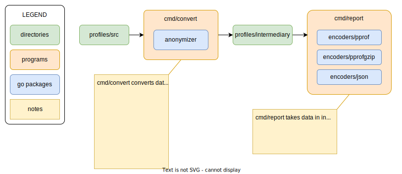

# Open Telemetry profiling benchmarks

This repository consists of:
* data sets (`/profiles`)
* parsers for various profiling formats (`/parsers/*`)
* tool to convert from various formats to intermediary format (`/cmd/convert`)
* encoders for various profiling formats (`/encoders/*`)
* tool to generate benchmarking reports (`/cmd/report`)



### Usage

#### To convert from source formats to intermediary format

```bash
# this will take files from /profiles/src and put converted files to /profiles/intermediary
make convert
```

#### To run the benchmarks and generate reports

```bash
# this will print a benchmark report in the terminal and put a markdown report at ./report.md
make report
```

### How to contribute

You can contribute by creating issues or pull requests. Best ways to contribute are:

* You can add profiles to the data set. In order to do that first add your profiles to `/profiles/src` directory. You can then run `make convert` to perform conversion and anonymization of symbol names and conversion into intermediary format. Anonymization is optional and has to be explicitly by adding "sensitive" to the file name.

* You can modify the encoder encoders (`/encoders`) and make improvements.

* You can make any other improvements to the repository.


### TODOs

This repository is work-in-progress. Most functionality is not yet implemented.

TODO:
* [ ] populate source data set (`/profiles/src`)
* [ ] implement converters / anonymizers for conversions from source formats to the intermediate format
* [ ] implement a tool for generating benchmark reports
* [ ] create a github actions workflow to run benchmarks on every PR and print results comparing the change to the main branch
